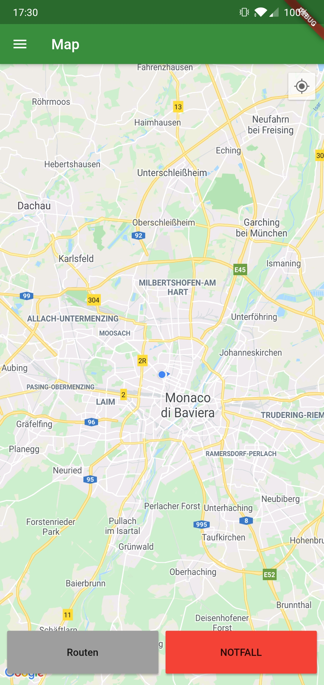
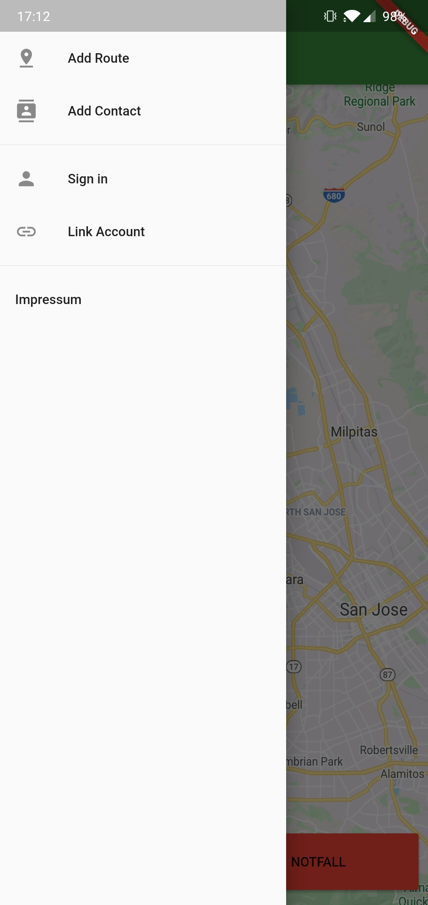
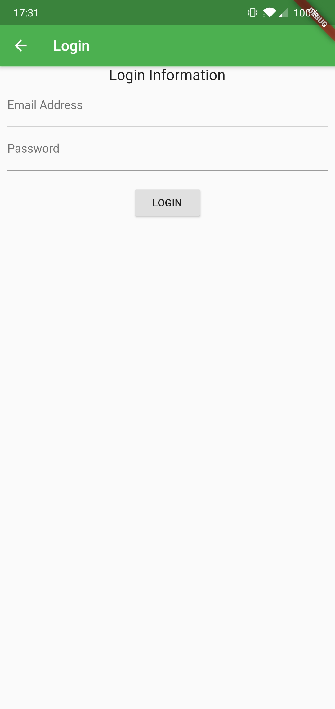
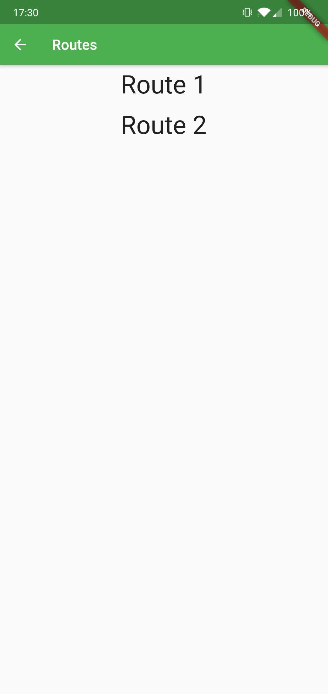
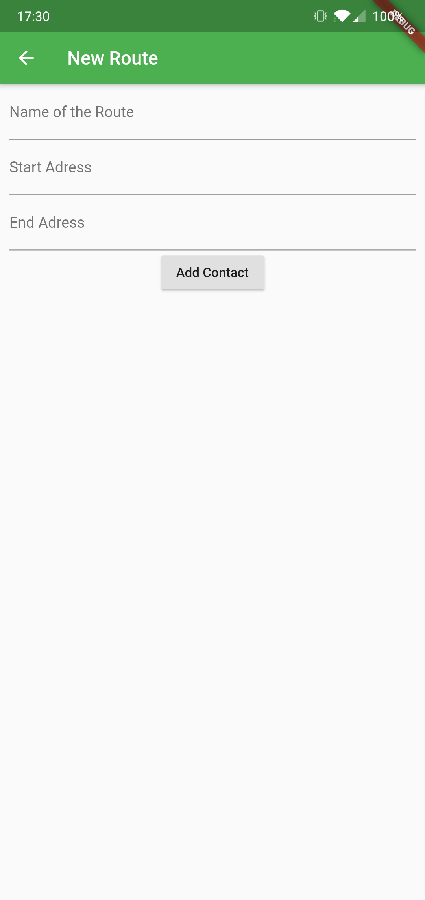
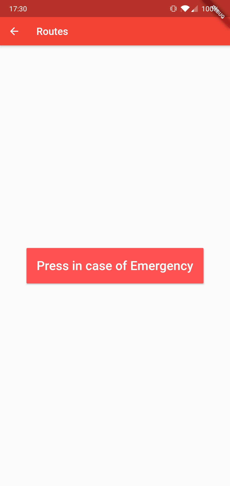
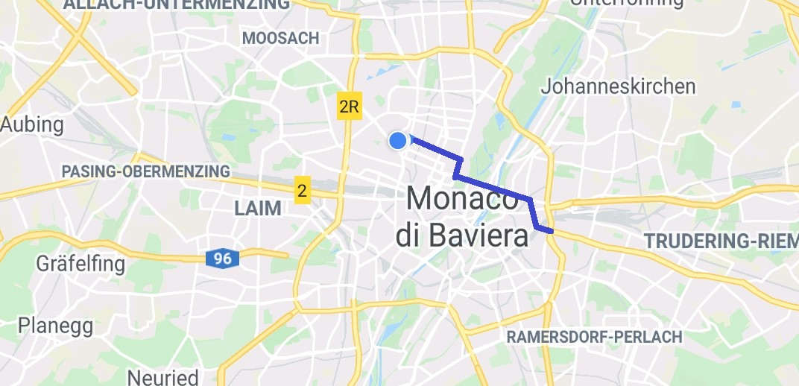

# Easymap

### Alzheimer-Gesellschaft, Hochschule München, Digital Transformation Lab

#### Team:

     - Florian Kaiser
     - Fabian Eckardt 
     - Benjamin Vanni

## Einleitung
Menschen mit Alzheimer benötigen viel Unterstützung um ihren Alltag bestreiten zu können. Technische Innovationen können Freunden und Verwandten viel Arbeit abnehmen und den Alltag des Patienten wieder lebenswerter zu gestalten.

## Problembeschreibung
Selbst wenn ein Alzheimer Patient noch körperlich fit ist, fällt es ihm oft schwer sich durch den Alltag zu bewegen. Oft mangelt es ihm an Orientierung.
Herkömmliche Kartenapps scheinen hierfür eine Lösung zu sein, sie sind allerdings viel zu umfangreich und dadurch komplex. Außerdem ist es schierig für Verwandte bei der Einrichtung dieser App zu helfen, wenn diese weiter weg leben.

## Beschreibung der Idee
Die Idee ist eine App die alle unnötig komplexen Funktionen weg lässt und gut aus der Ferne konfigurierbar ist. Sollte eine Situation den Patienten dennoch überforden kann er über einen Notfallknopf Hilfe anfordern.
Kernfunktion der App ist, dass bei der Routenfindung die Präferenz auf bekannten Strecken liegt und versucht wird bei einer Navigation von A nach B möglichst bekannte Streckenabschnitte zu wählen.
Durch einen Informationsknopf können zuvor hinterlegte Informationen zu Routen abgerufen werden.

##  Beschreibung der Lösung
Wenn die App geöffnet wird, erscheint eine Karte mit dem aktuellen Standort:

Über die Sidebar kann man sich einloggen, neue Routen und Notfall-Kontakte hinzufügen:

  

Ist man eingeloggt, kan man auf der Hauptseite die gespeicherten Routen auswählen:

Die Routen können sowohl von einen selbst als auch von einem Vertauten hinzugefügt werden.

Der Notfall-Knopf ruft eine Person aus der Notfall-Kontaktliste an:

Beispiel Navigation:

## Zusammenfassung
Die App bietet dem Alzheimerpatienten viel Freiheit sich durch seinen Alltag zu navigieren ohne das er sich darum sorgen muss sich zu verlaufen. Sollte es doch zu einer Situation kommen die weder der Patient noch die App lösen kann, kann unkompliziert um Hilfe gebeten werden.

